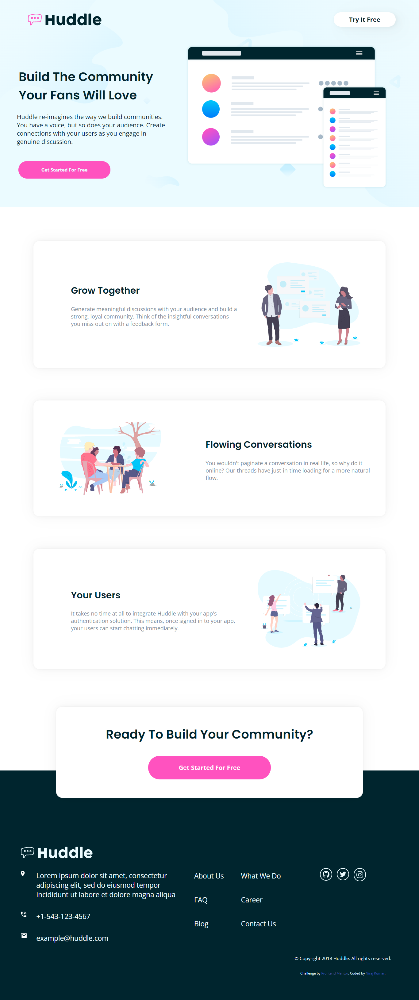
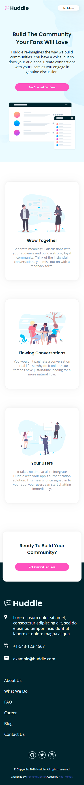

# Frontend Mentor - Huddle landing page with alternating feature blocks solution

This is a solution to the [Huddle landing page with alternating feature blocks challenge on Frontend Mentor](https://www.frontendmentor.io/challenges/huddle-landing-page-with-alternating-feature-blocks-5ca5f5981e82137ec91a5100). Frontend Mentor challenges help you improve your coding skills by building realistic projects. 

## Table of contents

- [Overview](#overview)
  - [The challenge](#the-challenge)
  - [Screenshot](#screenshot)
  - [Links](#links)
- [My process](#my-process)
  - [Built with](#built-with)
  - [What I learned](#what-i-learned)
- [Author](#author)


## Overview

### The challenge

Users should be able to:

- View the optimal layout for the site depending on their device's screen size
- See hover states for all interactive elements on the page

### Screenshot




### Links

- Solution URL: [Add solution URL here](https://your-solution-url.com)
- Live Site URL: [niraj-huddle-landing-page-version-2](https://niraj-huddle-landing-page-version-2.netlify.app/)

## My process

### Built with

- Semantic HTML5 markup
- CSS custom properties
- Flexbox
- CSS Grid
- Mobile-first workflow


### What I learned

- Learnt to select like this
```css

.parent:nth-child(even){
  background-color: red;
}

.parent>article:hover{
  color: pink;
}
```


## Author

<!-- - Website - [Add your name here](https://www.your-site.com) -->
- Frontend Mentor - [@niraj-kuamr-r](https://www.frontendmentor.io/profile/niraj-kumar-r)
- Twitter - [@niraj_kumar_r](https://www.twitter.com/niraj_kumar_r)

